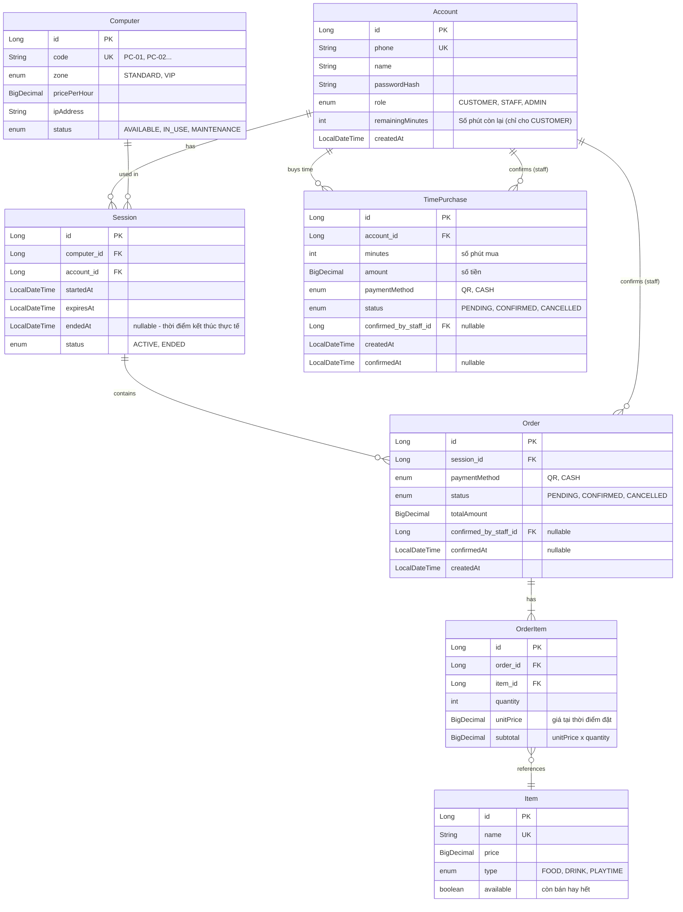

# Kế hoạch triển khai: Hệ thống Quản lý Tiệm Net (CyberNet)

## Tổng hợp nghiệp vụ đã thống nhất

Trước khi vào plan, anh ghi lại toàn bộ những gì anh và em đã thống nhất để không sót gì:

### Các đối tượng sử dụng
| Vai trò | Thao tác qua | Quyền chính |
|---|---|---|
| **Khách hàng** | Điện thoại (quét QR tại bàn) | Gọi món, thêm giờ, chọn thanh toán |
| **Nhân viên** | Máy tính/thiết bị quầy | Tạo TK khách, xác nhận thanh toán, quản lý phiên, chuyển máy |
| **Quản lý** | Máy tính/thiết bị quầy | Toàn bộ quyền NV + CRUD item/computer/NV + báo cáo |

### Flow mở phiên chơi

**Khách mới (lần đầu tới quán):**
```
Khách ra quầy → NV tạo TK (SĐT + tên + password)
→ Khách mua gói giờ tại quầy (tiền mặt/QR, NV xác nhận)
→ Giờ được cộng vào "số giờ còn lại" của TK
→ Khách tự chọn máy trống, ngồi vào, đăng nhập SĐT + password trên máy
→ Hệ thống kiểm tra TK còn giờ → mở phiên, bắt đầu trừ giờ
```

**Khách cũ (đã có TK, còn giờ):**
```
Khách ngồi vào máy bất kỳ đang trống
→ Đăng nhập SĐT + password trên máy
→ Hệ thống check: còn giờ → mở phiên, trừ giờ
                    hết giờ → không cho đăng nhập, phải mua giờ trước
```

**Đang chơi — gọi món/thêm giờ:**
```
Khách quét QR tại bàn bằng điện thoại
→ Trang web hiện ra → nhập SĐT (mỗi lần quét đều nhập)
→ Hệ thống đối chiếu: SĐT khớp với phiên đang mở tại máy đó
→ Hiện menu (đồ ăn/uống/thêm giờ)
→ Khách chọn nhiều món vào giỏ → tạo 1 đơn hàng
→ Chọn thanh toán QR hoặc tiền mặt
→ NV xác nhận → đơn CONFIRMED
→ Nếu có item "thêm giờ" → hệ thống tự cộng giờ vào phiên
→ Nếu có đồ ăn/uống → NV chuẩn bị mang tới máy
```

### Cơ chế giờ chơi
- **Trả trước** (mua gói giờ) → cộng vào "số giờ còn lại" (remainingMinutes) của Account
- Đăng nhập máy → bắt đầu trừ giờ (session tính thời gian thực tế)
- Hết giờ → tự động kết thúc phiên
- Mua thêm giờ (qua QR order) → cộng thêm vào remainingMinutes → session kéo dài

### Giá giờ chơi
- **Khác nhau theo loại máy/khu vực** (VIP 15K/h, thường 10K/h)
- Giá nằm trên Computer (pricePerHour) hoặc theo Zone
- **Có sơ đồ bố trí máy theo khu vực** — khách có thể xem sơ đồ trước để chọn máy, không phân vân

### Cấu trúc đơn hàng
- **1 Order = nhiều OrderItem** (giỏ hàng)
- Order: status, paymentMethod, totalAmount, session, confirmedByStaff...
- OrderItem: item, quantity, unitPrice, subtotal

### Thanh toán
- **Mỗi đơn thanh toán riêng** — không có "số dư tiền" trong TK
- 2 phương thức: QR chuyển khoản hoặc tiền mặt
- **Luôn cần NV xác nhận** dù thanh toán bằng cách nào

### Chức năng NV đặc biệt
- Chuyển khách sang máy khác (giữ giờ, đơn PENDING chuyển theo)
- Tạo đơn thủ công cho khách
- Kết thúc phiên thay khách
- Huỷ đơn hàng
- Cập nhật trạng thái máy (MAINTENANCE)
- Thêm giờ/tặng giờ cho khách

### Báo cáo (cho Quản lý)
- Doanh thu ngày/tuần/tháng
- Món bán chạy nhất
- Lịch sử giao dịch từng khách
- Top customer (chơi nhiều nhất)

### Phần KHÔNG làm trong giai đoạn này
- ❌ Phần mềm khoá/mở khoá trên máy chơi (client software) — tính sau
- ❌ Phần mềm cài trực tiếp trên máy chơi game: khi khách bật máy lên, phần mềm hiện ra cho phép gọi món, thêm giờ ngay trên máy đang dùng — bổ sung/thay thế cho việc dùng điện thoại
- ❌ Tích hợp ngân hàng tự động xác nhận QR
- ❌ App riêng cho khách / tích điểm

---

## Thiết kế Entity (sau khi thống nhất)



### Giải thích entity mới/thay đổi so với code hiện tại

| Entity | Thay đổi | Lý do |
|---|---|---|
| **Account** | +`passwordHash`, +`role`, +`remainingMinutes` | Cần login, phân quyền, và track giờ chơi |
| **Computer** | +`zone`, +`pricePerHour`, +`ipAddress` | Giá khác nhau theo loại máy |
| **Session** | +`endedAt` | Phân biệt "dự kiến hết giờ" vs "thực tế kết thúc" |
| **Item** | +`available` | Quản lý món hết hàng |
| **Order** | Bỏ `item_id`, `quantity`, `price` → tách ra OrderItem. Thêm `totalAmount`, `confirmedAt` | 1 order = nhiều món |
| **OrderItem** | **MỚI** | Dòng chi tiết trong đơn hàng |
| **TimePurchase** | **MỚI** | Track lịch sử mua giờ (tại quầy hoặc qua QR) — cần cho báo cáo doanh thu |

---

## Phase 0 — Sửa lại Entity layer (2–3 ngày)

**Mục tiêu**: Hoàn thiện data model cho đúng với nghiệp vụ đã thống nhất.

### Danh sách việc cần làm:
1. Sửa [Account.java](file:///d:/Antigravity/Java_SpringBoot/internet-cafe-management/src/main/java/com/cybernet/internet_cafe_management/entity/Account.java) — thêm `passwordHash`, `role`, `remainingMinutes`
2. Sửa [Computer.java](file:///d:/Antigravity/Java_SpringBoot/internet-cafe-management/src/main/java/com/cybernet/internet_cafe_management/entity/Computer.java) — thêm `zone`, `pricePerHour`, `ipAddress`
3. Sửa [Session.java](file:///d:/Antigravity/Java_SpringBoot/internet-cafe-management/src/main/java/com/cybernet/internet_cafe_management/entity/Session.java) — thêm `endedAt`
4. Sửa [Item.java](file:///d:/Antigravity/Java_SpringBoot/internet-cafe-management/src/main/java/com/cybernet/internet_cafe_management/entity/Item.java) — thêm `available`
5. Sửa [Order.java](file:///d:/Antigravity/Java_SpringBoot/internet-cafe-management/src/main/java/com/cybernet/internet_cafe_management/entity/Order.java) — bỏ item/quantity/price, thêm `totalAmount`, `confirmedAt`, thêm quan hệ 1-N với OrderItem
6. Tạo **OrderItem.java** — entity mới
7. Tạo **TimePurchase.java** — entity mới (lịch sử mua giờ)

### Kỹ thuật rèn luyện:
| Kỹ thuật | Ở đâu |
|---|---|
| JPA Relationships (1-N, N-1) | Order ↔ OrderItem, Account ↔ Session |
| `@OneToMany` + `cascade` + `orphanRemoval` | Order → OrderItem |
| Enum thiết kế | Role, Zone, PaymentMethod, Status |
| `BigDecimal` cho tiền | price, totalAmount, subtotal |
| Audit fields | `createdAt`, `confirmedAt` |

---

## Phase 1 — Repository + Service + REST Controller (1 tuần)

**Mục tiêu**: CRUD cho từng entity, theo kiến trúc 3 layer.

### Thứ tự (entity độc lập trước → phụ thuộc sau):
```
1. Account       (không phụ thuộc)
2. Computer      (không phụ thuộc)
3. Item          (không phụ thuộc)
4. TimePurchase  (phụ thuộc Account)
5. Session       (phụ thuộc Account + Computer)
6. Order + OrderItem (phụ thuộc Session + Item + Account)
```

### Mỗi entity tạo theo pattern:
```
repository/AccountRepository.java
dto/request/CreateAccountRequest.java
dto/response/AccountResponse.java
service/AccountService.java
controller/AccountController.java
```

### Cấu trúc package:
```
com.cybernet.internet_cafe_management
├── entity/
├── repository/
├── dto/
│   ├── request/
│   └── response/
├── service/
├── controller/
├── exception/          ← @ControllerAdvice, custom exceptions
├── config/             ← Security, CORS
└── util/               ← Helpers
```

### Kỹ thuật rèn luyện:
| Kỹ thuật | Ở đâu |
|---|---|
| Repository pattern | `JpaRepository`, custom query (`findByPhone`, `findByStatusAndZone`) |
| DTO pattern | Không bao giờ trả Entity ra API |
| Service layer | Validate → transform → persist |
| `@RestController` | CRUD endpoints, đúng HTTP method (POST/GET/PUT/DELETE) |
| `ResponseEntity` | HTTP status code chính xác (201, 404, 400...) |
| Global Exception Handler | `@ControllerAdvice` + `@ExceptionHandler` |
| Custom Exception | `ResourceNotFoundException`, `BusinessRuleException` |
| Stream API | Map Entity ↔ DTO |

---

## Phase 2 — Business Logic phức tạp (1–2 tuần)

**Mục tiêu**: Implement các luồng nghiệp vụ thực sự.

### UC-1: Mua giờ chơi (tại quầy hoặc qua QR)
```
1. Khách chọn gói giờ (hoặc NV chọn giúp tại quầy)
2. Tạo TimePurchase (status = PENDING)
3. Khách thanh toán (QR hoặc tiền mặt)
4. NV xác nhận → TimePurchase.status = CONFIRMED
5. Account.remainingMinutes += minutes mua
```

### UC-2: Đăng nhập máy — mở phiên chơi
```
1. API nhận (phone, password, computerCode)
2. Validate: TK tồn tại? Password đúng? Máy AVAILABLE? remainingMinutes > 0?
3. Tạo Session (startedAt = now, expiresAt = now + remainingMinutes)
4. Computer.status = IN_USE
5. Bắt đầu trừ giờ
```

### UC-3: Quét QR gọi món / thêm giờ
```
1. Khách quét QR → nhập SĐT → hệ thống check: có phiên ACTIVE tại máy này không? SĐT khớp?
2. Hiện menu → khách chọn nhiều món vào giỏ
3. Tạo Order (status = PENDING) + nhiều OrderItem
4. Tính totalAmount = sum(unitPrice × quantity)
5. Khách chọn thanh toán QR/tiền mặt
```

### UC-4: NV xác nhận đơn hàng
```
1. NV xem danh sách order PENDING
2. Kiểm tra tiền (QR: tiền đã về / Tiền mặt: nhận đủ)
3. Order.status = CONFIRMED, confirmedByStaff = NV, confirmedAt = now
4. Nếu order có OrderItem type PLAYTIME:
   → Account.remainingMinutes += minutes tương ứng
   → Session.expiresAt += thêm giờ
5. Nếu có FOOD/DRINK → NV chuẩn bị mang tới máy
```

### UC-5: Kết thúc phiên chơi
```
Tự động (@Scheduled):
   - Kiểm tra session nào expiresAt <= now → status = ENDED, endedAt = now
   - Computer.status = AVAILABLE
   
Thủ công (NV hoặc khách):
   - Session.status = ENDED, endedAt = now
   - Tính lại remainingMinutes (cộng lại giờ chưa dùng nếu kết thúc sớm)
   - Computer.status = AVAILABLE
```

### UC-6: Chuyển máy
```
1. NV chọn phiên đang ACTIVE + máy đích (AVAILABLE)
2. Máy cũ → AVAILABLE (hoặc MAINTENANCE)
3. Session.computer = máy mới
4. Máy mới → IN_USE
5. Đơn PENDING giữ nguyên — theo phiên
```

### UC-7: NV tạo đơn thủ công / huỷ đơn
```
Tạo đơn: NV chọn phiên + chọn món → tạo Order + OrderItem → confirm luôn
Huỷ đơn: Order.status = CANCELLED (chỉ huỷ được khi PENDING)
```

### Kỹ thuật rèn luyện:
| Kỹ thuật | Ở đâu |
|---|---|
| **@Transactional** | Mọi UC đều cần atomic (fail → rollback toàn bộ) |
| **Pessimistic Locking** | Tránh 2 khách cùng đăng nhập 1 máy |
| **Optimistic Locking** | Tránh trừ giờ đồng thời sai |
| **State Machine** | Order: PENDING → CONFIRMED/CANCELLED. Session: ACTIVE → ENDED |
| **Strategy pattern** | PLAYTIME item xử lý khác FOOD/DRINK khi confirm |
| **@Scheduled** | Auto kết thúc phiên hết giờ |
| **Bean Validation** | `@Valid`, `@NotNull`, `@Min`, `@Pattern` trên DTO |

---

## Phase 3 — Security + Authentication (1 tuần)

### Phân quyền:
| Endpoint | CUSTOMER | STAFF | ADMIN |
|---|---|---|---|
| Quét QR gọi món, thêm giờ | ✅ (qua web QR) | — | — |
| Xác nhận thanh toán | ❌ | ✅ | ✅ |
| Mở TK khách, quản lý phiên | ❌ | ✅ | ✅ |
| Chuyển máy, huỷ đơn | ❌ | ✅ | ✅ |
| CRUD Item/Computer/NV Account | ❌ | ❌ | ✅ |
| Báo cáo doanh thu | ❌ | ❌ | ✅ |

### Công nghệ:
- Spring Security 6 + JWT (access token + refresh token)
- BCrypt cho password
- `@PreAuthorize` cho role-based access

### Lưu ý đặc biệt:
- API cho khách quét QR (gọi món) **không cần JWT** — chỉ cần SĐT + kiểm tra phiên đang mở tại máy đó
- API cho NV/Admin **cần JWT** — đăng nhập bằng SĐT + password

---

## Phase 4 — Testing (1 tuần)

### Loại test:
1. **Unit Test** (JUnit 5 + Mockito) — test service layer
2. **Integration Test** (@SpringBootTest + H2) — test full flow
3. **API Test** (@WebMvcTest + MockMvc) — test REST endpoints

### Các case quan trọng cần test:
- Mua giờ → remainingMinutes tăng đúng
- Đăng nhập máy đã IN_USE → reject
- 2 khách cùng đăng nhập 1 máy → chỉ 1 thành công (locking)
- Order có PLAYTIME item → confirm → giờ được cộng
- Kết thúc phiên sớm → giờ dư trả lại remainingMinutes
- Chuyển máy → đơn PENDING theo phiên

---

## Phase 5 — Production-ready (1 tuần)

- [ ] Logging (SLF4J)
- [ ] Swagger/OpenAPI documentation
- [ ] Pagination + Sorting
- [ ] Flyway (thay `ddl-auto=update`)
- [ ] Docker + docker-compose
- [ ] Profile: dev vs prod
- [ ] Actuator health check
- [ ] **Báo cáo**: doanh thu, món bán chạy, lịch sử khách, top customer

---

## Phase 6 — Deploy (3–5 ngày)

- Build JAR → Dockerfile multi-stage
- docker-compose: app + MySQL + nginx
- Deploy lên VPS/cloud (Render/Railway)
- GitHub Actions CI/CD
- Domain + HTTPS

---

## Verification Plan

### Mỗi Phase:
- `mvn compile` — build thành công, không lỗi
- Test Postman cho từng API endpoint

### Phase 4+:
- `mvn test` — toàn bộ test pass
- `mvn verify` — Jacoco coverage ≥ 70%

### Phase 6:
- Truy cập URL public, test full flow end-to-end
- Swagger UI verify tất cả endpoints

---

> [!IMPORTANT]
> Em đọc kỹ plan này — đặc biệt phần **"Tổng hợp nghiệp vụ đã thống nhất"** và **"Thiết kế Entity"**. Nếu có chỗ nào anh hiểu sai nghiệp vụ của em, hoặc em muốn thêm/bớt gì, nói anh biết trước khi mình bắt tay vào Phase 0 nhé.
